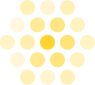
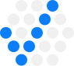

# Promote

A macOS agent multiplexer built on tmux. Promote lists your tmux sessions in a sidebar with git branch and PR status, embeds a terminal attached to the selected session, and tracks AI coding agents (claude, pi, cursor, opencode, codex) running in any pane — showing whether each one is working, waiting for input, or done.

## Requirements

- macOS 14+
- `tmux` and `gh` installed at `/opt/homebrew/bin` (Homebrew)
- `git` at `/usr/bin/git` (ships with Xcode Command Line Tools)

`gh` must be authenticated (`gh auth login`) for PR badges; without it they silently disappear.

## Install

```sh
./install.sh
```

Builds the release binary, packages `Promote.app`, and installs it to `/Applications`.

## Run from source

```sh
swift run Promote
```

## Usage

- Each row shows branch, PR status, and agent/service state — see [Sidebar session display](#sidebar-session-display) below.
- Activity panel appears at the bottom when any pane runs an agent CLI; click a row to jump to that session.
- Dev servers (node, npm, bun, yarn, pnpm, deno, turbo, …) show as a teal **Running** row in the same panel, and a teal dot appears left of the session name.

## Working with tmux sessions

Promote sits on top of your normal tmux — nothing is hidden or replaced:

- **Your existing sessions just appear.** Anything you start from a terminal (`tmux new -s foo`) shows up in the sidebar within a couple of seconds, and stays in sync as sessions come and go.
- **Nothing stops when you leave.** Selecting a session attaches to it; switching away or quitting the app leaves it running. You can also attach to the same session from a regular terminal at the same time.
- **Manage sessions without the command line.** Create (⌘N), rename, split panes, and kill sessions straight from the app — new sessions and splits open in the current directory.
- **Empty sidebar?** tmux isn't running any sessions. Hit ⌘N to start one. Your colors, groups, and ordering are remembered and come back with the sessions.

## Sidebar session display

Each session row shows, top to bottom: the session **name** (preceded by a teal dot when a dev server is running, and a lock icon when locked), the **repo path**, and a **PR badge** linking to the pull request for the current branch. A cluster of status dots on the right reflects the agent(s) running in that session; hold ⌘ (or hover) to reveal the session's jump-number badge. The current **branch** is available via right-click → *Copy Branch Name*.

```text
┌────────────────────────────────┐
│ 2                          ✳   │   ← agent status dots
│ Pawn/Promote                   │   ← repo path
│ #2 ( Open )               [1]  │   ← PR badge · jump number
├────────────────────────────────┤
│▌2                          ✳   │
│▌Pawn/Promote                   │   ← selected session
│▌#2 ( Closed )             [1]  │
├────────────────────────────────┤
│ 2                          ✳   │
│ Pawn/Promote                   │
│ #2 ( Merged )             [1]  │
└────────────────────────────────┘
```

PR badges follow `gh pr view` for the session's branch:

| Badge | State |
|-------|-------|
| 🔵 Open | PR is open |
| 🔴 Closed | Closed without merging |
| 🟢 Merged | PR was merged |
| ⚪ Draft | Open draft PR |

Right-click a session for the full menu:

- **Rename**, **Copy Name**, **Copy Path**, **Copy Branch Name**
- **Reveal in Finder**, **Open in VS Code**
- **Color** (palette / custom / none), **Group** (assign / new group)
- **Lock** (protect from ⌘W and Kill), **Kill Session**

## Keyboard shortcuts

| Shortcut | Action |
|----------|--------|
| Hold ⌘ | Reveal jump-number badges in the sidebar and a shortcuts hint |
| ⌘N | New session |
| ⌘1–9 | Jump to session (sidebar order) |
| ⌘\ | Split pane right |
| ⌘⇧\ | Split pane down |
| ⌘W | Close current pane |
| ⌘⇧R | Force refresh (reload PR / branch / agent status) |
| ⌘+ / ⌘− / ⌘0 | Terminal font size bigger / smaller / reset |
| ⌘/ | Keyboard shortcuts cheat sheet |

## Agent status colors

| Icon | Color | Status | Meaning |
|------|-------|--------|---------|
|  | Yellow | Working | Agent is actively running |
|  | Red | Blocked | Waiting for your input (permission prompt / y-n question) |
|  | Blue | Done | Finished working since you last looked |
|  | Gray | Idle | Agent open but nothing happening |
|  | Green | Running | Dev server / service is up (shown as a **Running** row and a dot left of the session name) |
