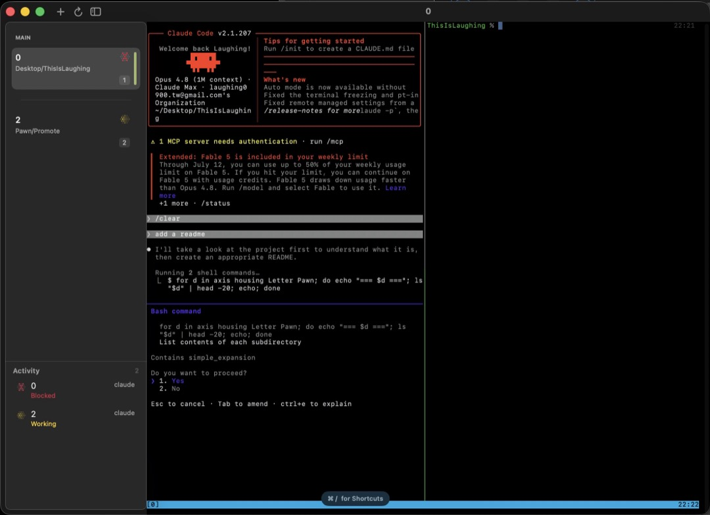
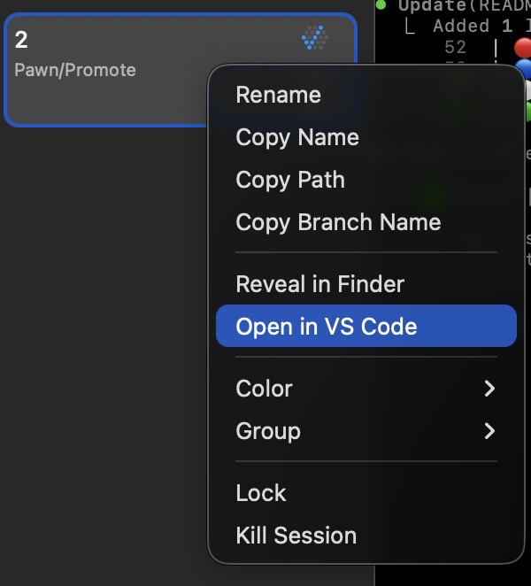
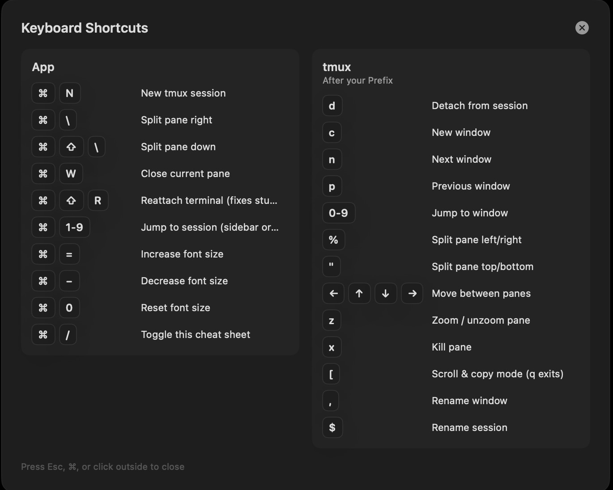

# Promote

A macOS agent multiplexer built on tmux. Promote lists your tmux sessions in a sidebar with git branch and PR status, embeds a terminal attached to the selected session, and tracks AI coding agents (claude, pi, cursor, opencode, codex) running in any pane — showing whether each one is working, waiting for input, or done.



## Requirements

- macOS 14+
- `tmux` and `gh` installed at `/opt/homebrew/bin` (Homebrew)
- `git` at `/usr/bin/git` (ships with Xcode Command Line Tools)

`gh` must be authenticated (`gh auth login`) for PR badges; without it they silently disappear.

## Install

```sh
./install.sh
```

Builds the release binary, packages `Promote.app`, and installs it to `/Applications`.

## Run from source

```sh
swift run Promote
```

## Usage

- Sessions appear in the sidebar automatically (refreshes every 2s); select one to attach.
- Right-click a session: Rename, Copy Name, Reveal in Finder, Color, Group, Kill.
- Activity panel appears at the bottom when any pane runs an agent CLI; click a row to jump to that session.
- Dev servers (node, npm, bun, yarn, pnpm, deno, turbo, …) show as a teal **Running** row in the same panel, and a teal dot appears left of the session name.



## Keyboard shortcuts



| Shortcut | Action |
|----------|--------|
| Hold ⌘ | Reveal jump-number badges in the sidebar and a shortcuts hint |
| ⌘N | New session |
| ⌘1–9 | Jump to session (sidebar order) |
| ⌘\ | Split pane right |
| ⌘⇧\ | Split pane down |
| ⌘W | Close current pane |
| ⌘⇧R | Reattach terminal (fixes stuck keys) |
| ⌘+ / ⌘− / ⌘0 | Terminal font size bigger / smaller / reset |
| ⌘/ | Keyboard shortcuts cheat sheet |

## Agent status colors

| Icon | Color | Status | Meaning |
|------|-------|--------|---------|
|  | Yellow | Working | Agent is actively running |
|  | Red | Blocked | Waiting for your input (permission prompt / y-n question) |
|  | Blue | Done | Finished working since you last looked |
|  | Gray | Idle | Agent open but nothing happening |
|  | Green | Running | Dev server / service is up (shown as a **Running** row and a dot left of the session name) |
